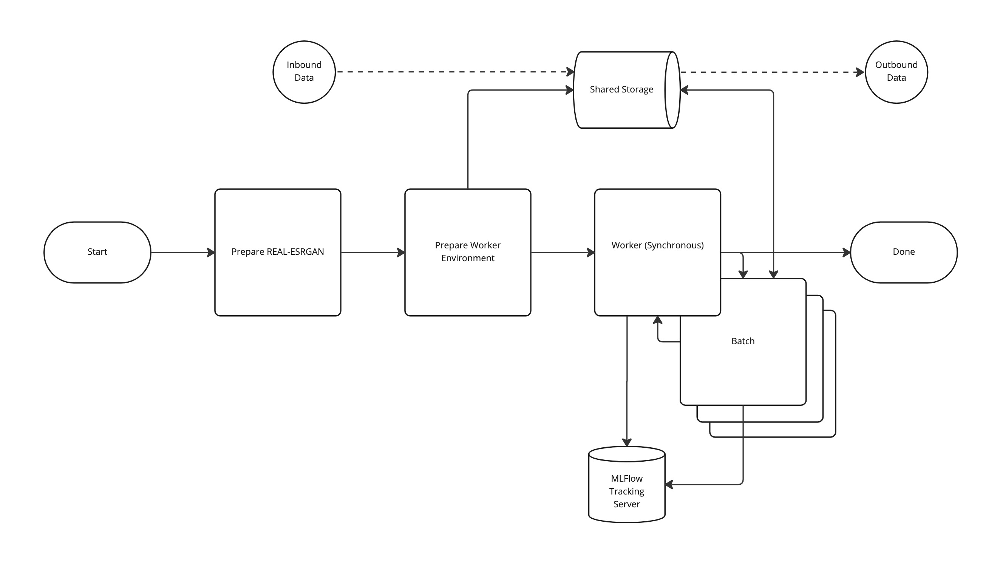

# Synchronous MLFlow Multi-Step Workflow With Background Jobs On Anaconda Enterprise

## Overview

Multi-Step Workflow
Different Steps Running In Different Modes

This multi-step workflow demonstrates how to run mlflow workflow steps as Anaconda Enterprise Project Run-Now Jobs.

A `run-now` job will be created on the project.  The name of the schedule will be the `run_id` of the child MLFlow run.

## Setup
The solution leverages pre-created conda environments for job runs. To accomplish this there is a one-time environment setup which needs to occur.

> anaconda-project run bootstrap

This command will build the worker conda environment and cache it within `/data`.  The jobs will expect it to be present when they are launched.

## Notebooks

* `entry_point` notebook has a stand-alone example of starting the `process_data` step of the workflow

## MLFlow Step Execution Through Command Line

* If you are executing these through the command line, then the environment variables MLFlow needs to communicate with the tracking server **MUST** be defined.
  * The easiest way to accomplish this is to uncomment the appropriate lines within anaconda-project.yml

  

Workflow [Native]
Workflow [MLFlow]
Workflow Step [Native]
Workflow Step [MLFlow]

