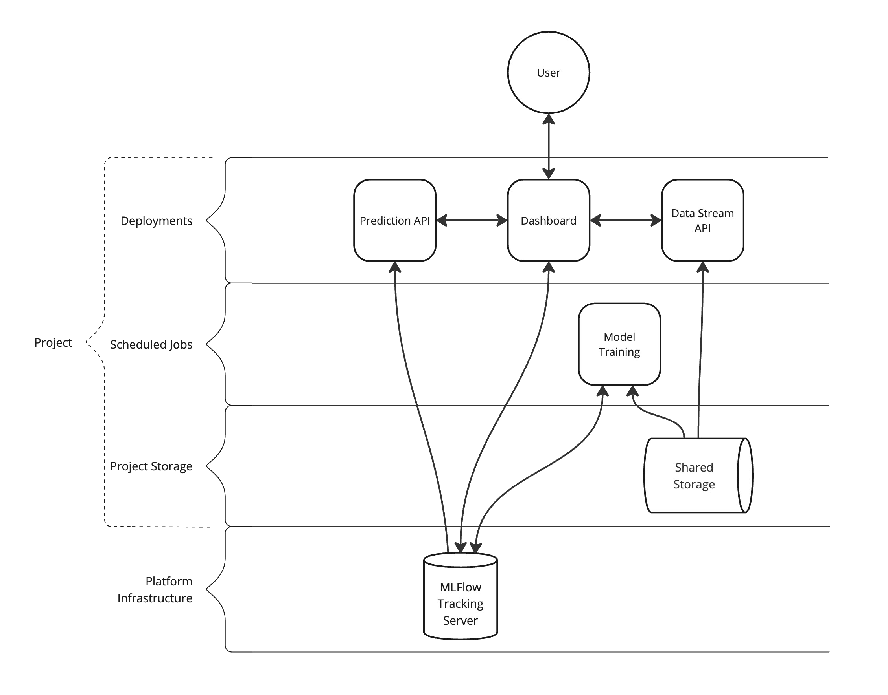

# Overview

### High-Level Project Diagram

### Deployments

#### Dashboard

The dashboard provides information about the project models and training runs.
Additionally, it provides a client consumer.

**Transaction Review**
1. Requests new data from the Data Stream API
2. Submits the data to the Prediction API
3. Displays transaction details and fraud predictions.

**Model Review**
1. Displays model information from the registry.
2. Displays training workflow run information.

#### Prediction API

* Exposes the project model through a REST API.
* The model version can be dynamically updated and accessed by multiple consumers.

#### Data Stream API

* Exposes training data through as REST API as time series samples.

### Scheduled Jobs

* The model training workflow is executed using the ADSP job scheduler and runs in the background async.

### Project Storage

* The project-level shared storage is used to store training data.

### Platform Infrastructure

* The MLflow Tracking Server deployed within the ADSP cluster will be leveraged for tracking of experiment runs and trainined models.
