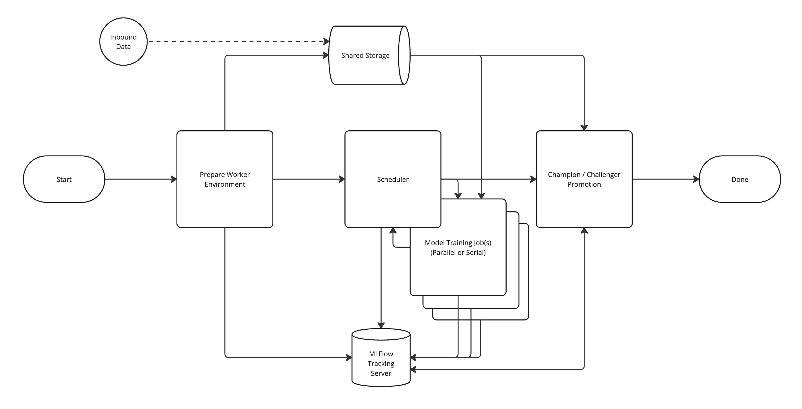

# Model Training

### Workflow Data Flow Diagram

### Step 1 [Prepare Worker Environment]
  * This step executes within the session/job that starts the workflow.
  * Worker startup times need to be as fast as possible.  To aid in startup the conda environment for the logic will be stored within `data` and used by all workers.
  This prevents multiple repeated environment setups and much faster over-all processing times. 
  * If this step is run multiple times it will skip repacking the environment.
  * Reports to the MLFlow Tracking Server

### Step 2 - [Scheduler]
  * This step executes within the session/job that starts the workflow.
  * Generates the training jobs, and blocks until jobs have completed.
  * The scheduler will enforce a limit on the number of new jobs executing at once during the workflow.
  * Reports to the MLFlow Tracking Server

### Step 2′ - [Model Training]
  * These step(s) execute within Project Jobs when run within ADSP.
  * Training the model with the select parameters.
  * Reports to the MLFlow Tracking Server

### Step 3 - [Champion / Challenger Promotion]
  * This step executes within the session/job that starts the workflow.
  * Reports to the MLFlow Tracking Server
