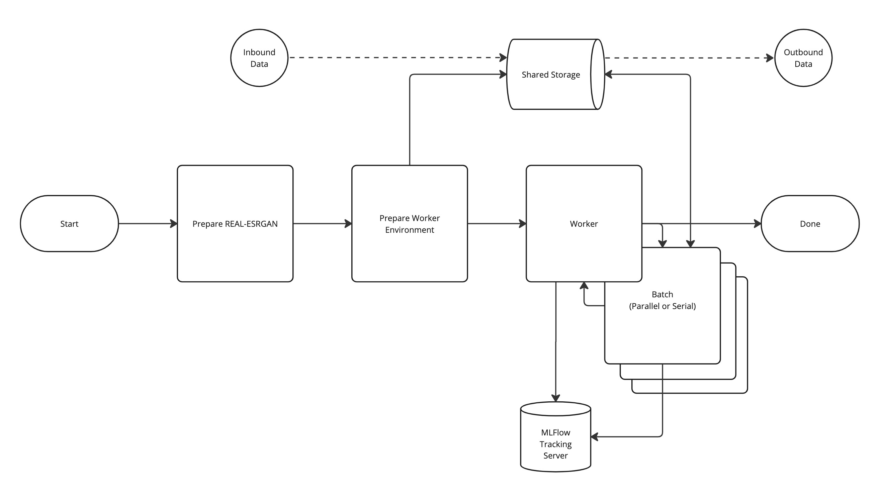

# Super Resolution With Real ESRGran - MLFlow Driven Parallelism within ADSP

## Overview

This solution leverages https://github.com/xinntao/Real-ESRGAN for applying super resolution enhancement to images.

## Setup
1. Download the solution.
2. Ensure the variable `MLFLOW_EXPERIMENT_NAME` within the `anaconda-project.yml` is updated appropriately.
3. Upload the project into AE5
> ae5 project upload .
4. Start a project session and allow conda to complete dependency installation.
5. Ensure you have the below AE5 secrets defined, or uncommented and added to the `anaconda-project.yml` file.
    
    | Variable              |
    |-----------------------|
    | AE5_HOSTNAME          |
    | AE5_USERNAME          |
    | AE5_PASSWORD          |
    | ADSP_WORKER_MAX       |
    | MLFLOW_TRACKING_URI   |
    | MLFLOW_REGISTRY_URI   |
    | MLFLOW_TRACKING_TOKEN |

#### Run Worker Environment Boostrap

This is not strictly required to do so before the first run, however its a good sanity check of the environment.
> anaconda-project run bootstrap

## Workflow

Image processing occurs in batches (parallel) processed by background AE5 jobs.

### Workflow Diagram

### Step 1 [Prepare Real-ESRGAN]
  * This step executes locally (within the session).
  * The source and dependencies for the framework are downloaded and prepared.
  * Reports to the MLFlow Tracking Server

### Step 2 [Prepare Worker Environment]
  * This step executes locally (within the session). 
  * Worker startup times need to be as fast as possible.  To aid in startup the conda environment for the logic will be stored within `/data` and used by all workers.
  This prevents multiple repeated environment setups and much faster over-all processing times. 
  * If this step is run multiple times it will skip repacking the environment.
  * Reports to the MLFlow Tracking Server

### Step 3 - [Worker Management]
  * This step executes locally (within the session)
  * The inbound files will be split up into batches and assigned to a worker to process. 
  * Reports to the MLFlow Tracking Server

### Step 3 - [Batch Processing]
  * This step executes externally (within a project job)
  * Reports to the MLFlow Tracking Server

### Usage

**Local Session**

* To run the processing completely within the local session:
> anaconda-project run workflow:main:local

**Background Jobs**

* To run the processing in background jobs:
> anaconda-project run workflow:main:adsp

**Data**

* The workers will process batches of files from: `data/inbound`
* The workers will produce files with `_out` suffix added to the file names and place the results in: `data/outbound`

## Notes
* If running the example outside of Anaconda Enterprise use `local` mode.