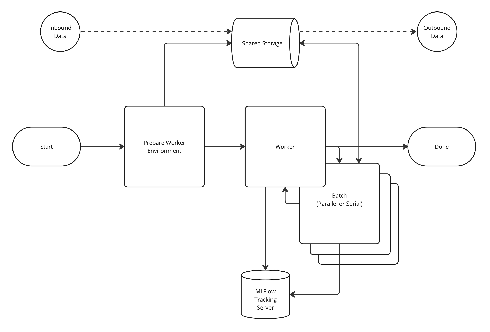

# Stable Diffusion |  MLFlow Driven Parallelism within ADSP

## Overview

This solution leverages https://keras.io/api/keras_cv/models/stable_diffusion/ to generate imagery from textual prompts.

## Setup
1. Download the solution.
2. Ensure the variable `AE_MLFLOW_EXPERIMENT_NAME` within the `anaconda-project.yml` is updated appropriately.
3. Upload the project to ADSP.
    > ae5 project upload .
4. Start a project session and allow conda to complete dependency installation. 
   1. Perform the one time ADSP account setup for Keras (see below) if this has not yet been completed.
7. Ensure you have the below AE5 secrets defined, or uncommented and added to the `anaconda-project.yml` file.
    
    | Variable              |
    |-----------------------|
    | AE5_HOSTNAME          |
    | AE5_USERNAME          |
    | AE5_PASSWORD          |
    | ADSP_WORKER_MAX       |
    | MLFLOW_TRACKING_URI   |
    | MLFLOW_REGISTRY_URI   |
    | MLFLOW_TRACKING_TOKEN |

### Keras Setup for parallel processing within ADSP

#### Account Level One Time Setup

Within `/opt/continuum` create a symbolic link `.keras` to --> `user/home/.keras`

> cd /opt/continuum && ln -s user/home/.keras .keras

This allows keras to download and cache models, checkpoints, datasets, etc between all instances.
If this step is not completed each time Keras executes in a new session, or job it will re-download these external resources.

#### Run Worker Environment Boostrap

This is not strictly required to do so before the first run, however its a good sanity check of the environment.
> anaconda-project run bootstrap

## Workflow

Image processing occurs in batches.  If executing locally the batches are processed in serial, when running within ADSP these are processed in parallel.

Parallel execution occurs within ADSP `run-once` jobs associated with the project.  The scheduler will block until all jobs have completed.

### Workflow Diagram

### Step 1 [Prepare Worker Environment]
  * This step executes locally (within the session).
  * Worker startup times need to be as fast as possible.  To aid in startup the conda environment for the logic will be stored within `data` and used by all workers.
  This prevents multiple repeated environment setups and much faster over-all processing times. 
  * If this step is run multiple times it will skip repacking the environment.
  * Reports to the MLFlow Tracking Server

### Step 2 - [Worker Management - Scheduler]
  * This step executes locally (within the session)
  * Generates the batches, processing requests, and blocks until jobs have completed.
  * Reports to the MLFlow Tracking Server

### Step 2′ - [Batch Processing]
  * This step executes externally (within a project job) when run within ADSP.
    * The scheduler will enforce a limit on the number of new jobs executing at once during the workflow.
  * Reports to the MLFlow Tracking Server

### Usage

**Local Session**

* To run the processing completely within the local session:
> anaconda-project run workflow:main:local

Full example:
> anaconda-project run workflow:main:local --total-batch-size 1 --per-worker-batch-size 1 --prompt "dragons"

**Background Jobs**

* To run the processing in background jobs:
> anaconda-project run workflow:main:adsp

Full example:
> anaconda-project run workflow:main:adsp --total-batch-size 3 --per-worker-batch-size 1 --prompt "dragons"

**Data**

* The workers will output images into `data`, as well as attaching to the child-runs of the experiment in MLFlow.

## Notes
* If running the example outside of Anaconda Enterprise use `local` mode.